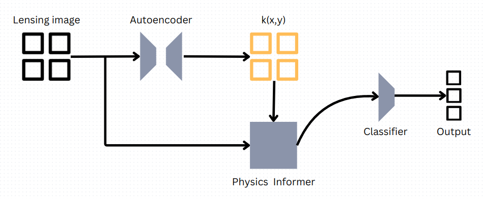
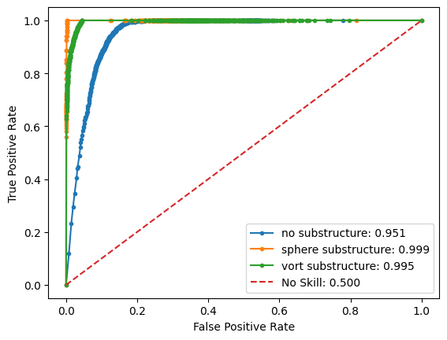
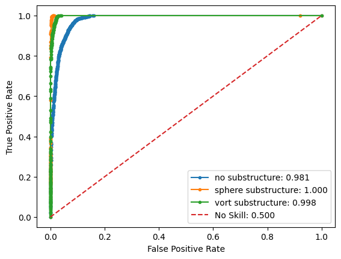
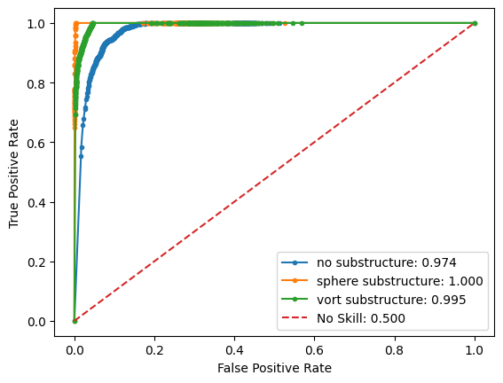
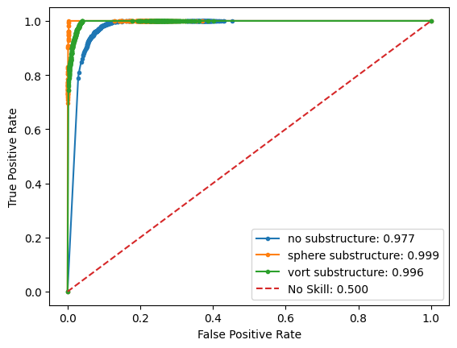

# Evaluation task for DeepLense: PINNs

#### March 2024

### Anirudh Shankar

## 1. Overview

This document contains a description of responses to the Common Test I. Multi-Class Classification and the Specific Test V: Physics-Guided ML. Overall, the models used for the tasks are different architectures that use Residual Learning presented in the original article by K He, X Zhang, S Ren and J Sun $^{[1]}$. An initial description of all the models used is followed by training and evaluation procedure, and then the results and inference.

## 2. Models

This section provides a brief description of the models, as they are named in the repository.
1. Resnet_18: An implementation of the ResNet18 $^{[1]}$ **classifier** adjusted for image shape, image channels and output classes to match the DeepLense Dark Matter Substructre dataset.
2. Resnet_simple: A greatly simplified residual **classifier** using 2 residual blocks (convolution, normalization and activation) involving 10 convolution layers in total. Its often used in conjunction with other models as a classifier as it is much lighter than *Resnet_18*.
3. Autoencoder_resnet_simple: An **autoencoder** module using a modified *resnet_simple* module as its encoder and a similar decoder module using inverted residual blocks (that perform transposed convolution).
4. SIS_autoencoder and SIS_autoencoder2: The autoencoder module generates $k(x,y)$ in two ways that are illustrated in the following section, which transforms the lensing images before being fed to a **classifier**. They serve to compare performance with the other physics-informed models using the SIS lensing equations as an ansatz.
Below is a summary of the same:

| Model | Architecture | Purpose |
| ----- | ------------ | ------- |
| Resnet_18 | Classifier | Benchmark performance |
| Resnet_simple | Classifier | Comparison with Resnet_18 |
| Autoencoder_resnet_simple | Autoencoder | Generate $k(x,y)$ or regenerate the lensing images from a latent space |
| SIS_autoencoder | Physics-informed classifier | Improve classification |
| SIS_autoencoder2 | Physics-informed classifier | Improve classification |

## 3. Methods and motivation

All models are trained using a 90:10 train:validation split on the training dataset, and then evaluated for ROC statistics separately using the test dataset at the end of training. All training notebooks can be found in the repository. Training was almost always done for 200 epochs, and then fine-tuned for a few more if deemed necessary.

### 3.1 Data, augmentation and resources
The dataset used is the lensing images with dark matter substructure presented in $^{[2]}$. To present a broader variety in data for training, the lensing images are (1) rotated randomly (2) scaled between 0.8 to 1.2 times the input.
All the models are trained and tested on my personal GeForce RTX 3050 (mobile) GPU.

### 3.2 Single Isothermal Sphere Model:
Lensing can be described by the SIS model as:
$$\overrightarrow{I} = \overrightarrow{S} - \overrightarrow{\nabla}\Psi\overrightarrow{(I)} $$
Where $i$ represents the image position vector, and $O$ is its post lensed counterpart:
$$\begin{pmatrix} O_y\\ O_x \end{pmatrix} = \begin{pmatrix} i_y\\ i_x \end{pmatrix} - \overrightarrow{\nabla}\Psi\begin{pmatrix} y\\ x \end{pmatrix}\tag1$$
Approximating the potential contributions to be majorly from baryonic matter (in the galaxy) and using the Singular Isothermal Sphere (SIS) model, we are able to derive a proportionality between the potential and the radial distance between the center of the galaxy and the point in space:
$$\Psi \approx \Psi_{galaxy} \propto r(x,y)=k(x,y)\cdot\sqrt{x^2+y^2}$$
$$\overrightarrow{\nabla}\Psi = \overrightarrow{\nabla}[k(x,y)\cdot\sqrt{x^2+y^2}]$$
$$=\begin{pmatrix} \frac{\delta [k(x,y)\sqrt{x^2+y^2}]}{\delta y}\\ \frac{\delta [k(x,y)\sqrt{x^2+y^2}]}{\delta x} \end{pmatrix}=\begin{pmatrix} \frac{\delta k}{\delta y}r+\frac{k}{r}y\\ \frac{\delta k}{\delta x}r+\frac{k}{r}x \end{pmatrix}\tag2$$
Before we use $(2)$ in $(1)$, we need to evaluate the partial derivatives of $k$. In this architecture, the proportionality $k$ is generated by autoencoders (*LensAutoEncoder* in the repository). We can thus describe $k$ as a function of all the convolutions that came before it:
$$k = f_1∘f_2...∘f_n\begin{pmatrix} i\end{pmatrix}$$ where $i$ is the lensing data. We can evaluate the derivative of k using the chain rule of derivatives,
$$\delta k = \prod_{m=1}^{n}\delta f_m∘f_{m+1}...∘f_n$$For our purpose, each of these terms is simply the gradient of each convolutional layer computed from its predecessors. This, where $L_m$ represents the m'th layer from the end,
$$\delta k = \prod_{m=1}^{n}\overrightarrow{\nabla} L_m\tag3$$ 
For practicality, we can choose to ignore this term, setting $\delta k=0$ given that the successive product of just the gradients of each layer must be very small. Using the approximation $(3)$, we can gather $(1)$ and $(2)$.
$$\begin{pmatrix} O_y\\ O_x \end{pmatrix} = \begin{pmatrix} i_y\\ i_x \end{pmatrix} - \begin{pmatrix} \frac{k}{r}y\\ \frac{k}{r}x \end{pmatrix}$$
$$\begin{pmatrix} i_y\\ i_x \end{pmatrix}=\begin{pmatrix} O_y\\ O_x \end{pmatrix} + \begin{pmatrix} \frac{k}{r}y\\ \frac{k}{r}x \end{pmatrix} \tag4$$
$(4)$ gives the model that is used as an ansatz to classify the lensing images based on their substructure.
It is to note that another option would be to not use approximation $(3)$, and append the partial derivatives of $k$ in the correction, but it has not been done in this analysis.

### 3.3 Physics informer

The *Autoencoder_resnet_simple* model generates tensors of the same lensing image dimensions, which is interpreted as $k(x,y)$. The lensing images used as inputs are transformed as given by $(4)$, to generate new positions for the intensities in the lensing images, pixel-wise.

*SIS_autoencoder* and *SIS_autoencoder2* handle overlapping transformed positions as follows:
1. *SIS_autoencoder* overwrites intensities to present only one (the most recent pixel)
2. *SIS_autoencoder2* sums them linearly (assuming no signifiant contribution from phase differences). This is a more physical result.

Both SIS_autoencoders are trained using domain adaptation by loading them with pre-trained weights of the *Autoencoder_resnet_simple* trained to re-generate the lensing images.
The lensed images are then fed to a classifier.

## 4. Results

Evaluation metrics include AUC scores with ROC curves plotted for each class representing each dark matter substructure. These metrics are calculated using data from the test dataset.

| Model | no | sphere | vort | Mean |
| ----- | --- | --- | --- | --- |
| Resnet_simple | 0.951 | 0.999 | 0.995 | 0.982 |
| Resnet_18 | 0.981 | 1.000 | 0.998 | **0.993** |
| SIS_autoencoder | 0.974 | 1.000 | 0.995 | 0.990 |
| SIS_autoencoder2 | 0.977 | 0.999 | 0.996 | **0.991** |

##### 4.1 Resnet_simple

##### 4.2 Resnet_18

##### 4.3 SIS_Autoencoder

##### 4.4 SIS_Autoencoder2

## 5. Inference

* Informing the model with the SIS equation improves classification performance, as expected. While the *Resnet_18* classifier does improve performance over the *Resnet_simple* and even the Physics-Informed models, this can be interpreted as although physics-informed and vastly increasing performance when compared to just the classifier *resnet_simple*, using *resnet_18* or any other deeper network will certainely help the physics-informer reach even better performances.
* The correction presented by *SIS_autoencoder2* provides a notable increase in classification accuracy

## 6. Perspective

* A direct improvement to the used physics-informed models can be the utilisization of a deeper model such as *Resnet_18* as a classifier.
* A possible expansion is the utilization of two levels of classifiers as done in $^{[2]}$, where the first selects the two most probable classes, and the second more accuratly differentiates between them. 
* Another expansion is to not use approximation $(3)$, and to include the gradients of all the convolution layers in the architecture in the lensing equation
* Transformer architectures replacing the autoencoder to generate $k(x,y)$ could improve performance, being able to better handle localised positional information
## 7. Bibliography

1. He, K., Zhang, X., Ren, S., & Sun, J. (2016). Deep residual learning for image recognition. In Proceedings of the IEEE conference on computer vision and pattern recognition (pp. 770-778).
2. Alexander, S., Gleyzer, S., McDonough, E., Toomey, M. W., & Usai, E. (2020). Deep learning the morphology of dark matter substructure. The Astrophysical Journal, 893(1), 15.
